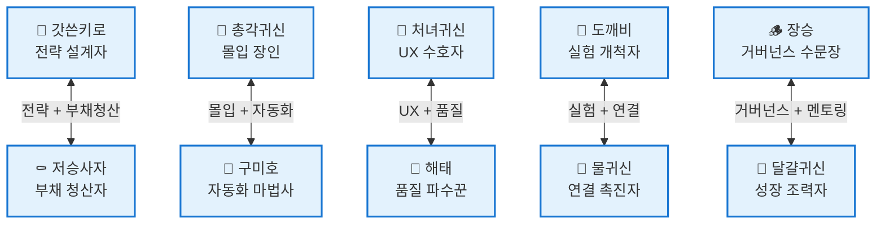
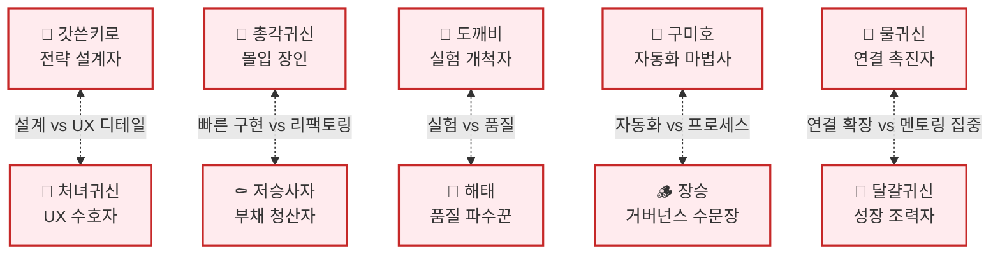
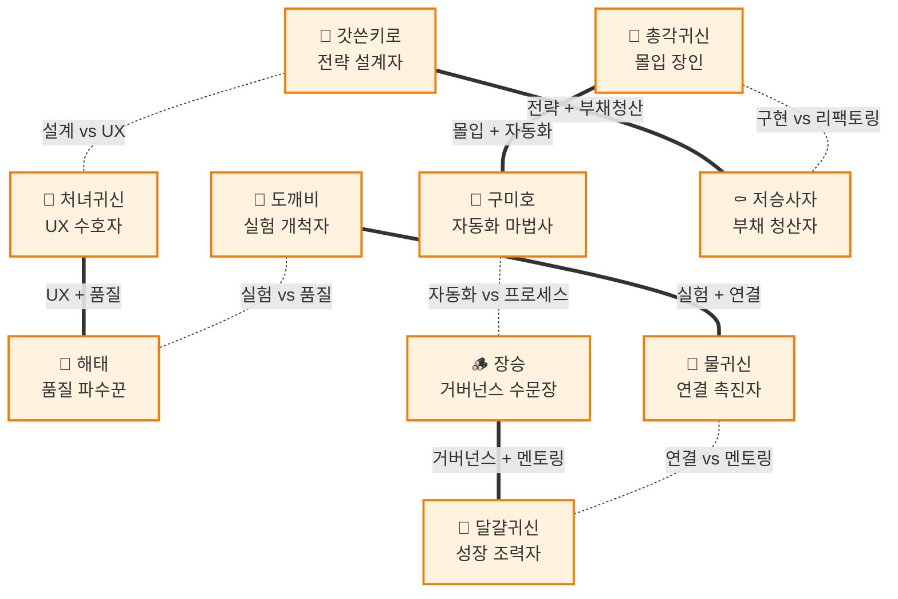

# 키로 프렌즈 캐릭터 네트워크 시각화

## 시너지 관계 (협업 시너지)

## 긴장 관계 (충돌 관계)

## 통합 네트워크 (시너지 + 긴장)

## 관계 매트릭스

### 시너지 관계

| 캐릭터 | 시너지 대상 | 관계 유형 |
|--------|------------|----------|
| 👑 갓쓴키로 | ⚰️ 저승사자 | 상호 |
| 👻 총각귀신 | 🦊 구미호 | 상호 |
| 👰 처녀귀신 | 🦁 해태 | 상호 |
| 👹 도깨비 | 🌊 물귀신 | 상호 |
| 🦊 구미호 | 👻 총각귀신 | 상호 |
| 🦁 해태 | 👰 처녀귀신 | 상호 |
| 🪵 장승 | 🥚 달걀귀신 | 상호 |
| ⚰️ 저승사자 | 👑 갓쓴키로 | 상호 |
| 🌊 물귀신 | 👹 도깨비 | 상호 |
| 🥚 달걀귀신 | 🪵 장승 | 상호 |

### 긴장 관계

| 캐릭터 | 긴장 대상 | 관계 유형 |
|--------|----------|----------|
| 👑 갓쓴키로 | 👰 처녀귀신 | 상호 |
| 👻 총각귀신 | ⚰️ 저승사자 | 상호 |
| 👰 처녀귀신 | 👑 갓쓴키로 | 상호 |
| 👹 도깨비 | 🦁 해태 | 상호 |
| 🦊 구미호 | 🪵 장승 | 상호 |
| 🦁 해태 | 👹 도깨비 | 상호 |
| 🪵 장승 | 🦊 구미호 | 상호 |
| ⚰️ 저승사자 | 👻 총각귀신 | 상호 |
| 🌊 물귀신 | 🥚 달걀귀신 | 상호 |
| 🥚 달걀귀신 | 🌊 물귀신 | 상호 |

## 네트워크 통계

### 시너지 관계
- **총 연결**: 10개
- **상호 시너지**: 5쌍 (100%)
- **일방향 시너지**: 0개
- **특이사항**: 모든 캐릭터가 정확히 1개의 상호 시너지 관계 보유

### 긴장 관계
- **총 연결**: 10개
- **상호 긴장**: 5쌍 (100%)
- **일방향 긴장**: 0개
- **각 캐릭터 언급 횟수**: 정확히 1회 (완벽한 균형)

### 전체 네트워크
- **고립된 캐릭터**: 0명
- **네트워크 밀도**: 높음 (모든 캐릭터 연결됨)
- **밸런스 점수**: 100% (완벽한 균형)

## 관계 의미

### 시너지 쌍 (협업 시 시너지 효과)
1. **갓쓴키로형 ↔ 저승사자형**: 전략적 설계 + 기술 부채 청산 = 지속 가능한 아키텍처
   - 갓쓴키로가 설계한 구조를 저승사자가 레거시 코드에 점진적으로 적용
   - 장기적 비전과 실질적 개선이 만나 안정적인 시스템 진화
2. **총각귀신형 ↔ 구미호형**: 극한의 몰입 + 자동화 = 폭발적 생산성
   - 총각귀신의 집중력을 구미호의 자동화 도구가 배가시킴
   - 반복 작업은 자동화하고 핵심 로직에만 몰입하여 최고 효율 달성
3. **처녀귀신형 ↔ 해태형**: UX 디테일 + 품질 보증 = 완벽한 사용자 경험
   - 처녀귀신의 UX 감각을 해태의 테스트로 검증하여 완성도 극대화
   - 사용자 경험과 안정성을 동시에 확보한 프로덕트 완성
4. **도깨비형 ↔ 물귀신형**: 실험 + 연결 = 혁신적 통합
   - 도깨비의 새로운 기술을 물귀신이 기존 시스템과 연결
   - 실험적 시도가 실제 가치로 전환되는 혁신 사이클 구축
5. **장승형 ↔ 달걀귀신형**: 거버넌스 + 추상화 = 일관되고 깔끔한 코드베이스
   - 장승의 규칙과 달걀귀신의 단순화가 만나 명확한 코드 표준 확립
   - 팀 전체가 이해하기 쉬운 일관된 코드 스타일 유지

### 긴장 쌍 (충돌 가능성)
1. **갓쓴키로형 ↔ 처녀귀신형**: 완벽한 설계 vs UX 디테일 집착
   - 갓쓴키로는 구조적 완성도를, 처녀귀신은 사용자 경험 디테일을 우선시
   - 설계 단계에서 시간을 쓸지, UI 완성도에 쓸지 우선순위 충돌
2. **총각귀신형 ↔ 저승사자형**: 빠른 구현 vs 완벽한 리팩토링
   - 총각귀신은 몰입해서 빠르게 구현, 저승사자는 코드 품질 개선 요구
   - "일단 돌아가게" vs "제대로 다시 짜자"의 갈등
3. **도깨비형 ↔ 해태형**: 실험적 기술 vs 검증된 품질
   - 도깨비는 새 기술 도입, 해태는 안정성과 테스트 커버리지 요구
   - 혁신 속도와 품질 보증 사이의 균형점 찾기 어려움
4. **구미호형 ↔ 장승형**: 자동화 추구 vs 프로세스 준수
   - 구미호는 효율을 위해 자동화, 장승은 정해진 프로세스 준수 요구
   - "빠르게 자동화" vs "규칙대로 진행"의 충돌
5. **물귀신형 ↔ 달걀귀신형**: 연결 확장 vs 단순화 추구
   - 물귀신은 더 많은 시스템 연결, 달걀귀신은 불필요한 의존성 제거 추구
   - 통합의 가치와 단순함의 가치 사이의 트레이드오프
