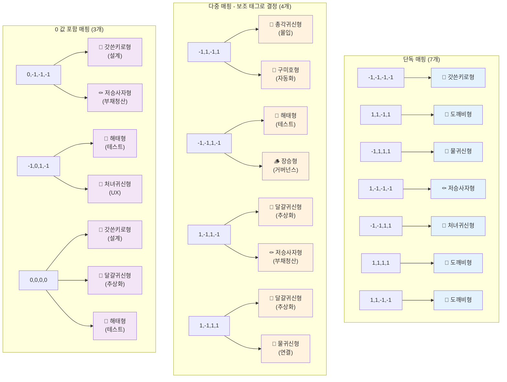

# 캐릭터별 질문 패스 시각화

## 개요

각 캐릭터에 도달하기 위한 16문항 응답 패턴을 시각화합니다.

- Q1-Q8: 4축 성향 측정 (각 축당 2문항)
- Q9-Q16: 보조 태그 측정 (8개 태그 각 2번 등장)

**최신 업데이트 (2025):** 매핑 테이블이 단순화되어 다중 후보군 매핑이 8개에서 4개로 축소되었습니다.

## 4축 정의

| 축 | 음수(-1) | 양수(+1) |
|---|---|---|
| A | 안정 | 실험 |
| B | 구조 | 즉흥 |
| C | 개인 | 협업 |
| D | 품질 | 속도 |

## 캐릭터별 응답 패턴

### 👑 갓쓴키로형 (전략 설계자)

**4축 값**: A=-1, B=-1, C=-1, D=-1 (안정, 구조, 개인, 품질)  
**Primary Tag**: 설계

**Q1-Q8 응답 패턴**:
```
Q1: 검증된 기술 선택 (A: -1)
Q2: 설계 문서 먼저 작성 (B: -1)
Q3: 혼자 깊이 파고들어 해결 (C: -1)
Q4: 코드 품질과 테스트 우선 (D: -1)
Q5: 검증된 해결책 적용 (A: -1)
Q6: 전체 구조와 설계 패턴 확인 (B: -1)
Q7: 혼자 집중해서 완성 (C: -1)
Q8: 확장 가능한 구조로 견고하게 (D: -1)
```

**Q9-Q16 보조 태그 전략**:
- 설계 태그 선택 우선 (Q9, Q11, Q13, Q15 중 최소 2개)
- 시스템 아키텍처, 설계 대안 비교, 확장 가능한 구조 등

---

### 👻 총각귀신형 (몰입 장인)

**4축 값**: A=-1, B=+1, C=-1, D=+1 (안정, 즉흥, 개인, 속도)

**Primary Tag**: 몰입

**Q1-Q8 응답 패턴**:
```
Q1: 검증된 기술 선택 (A: -1)
Q2: 코드 작성하면서 방향 잡기 (B: +1)
Q3: 혼자 깊이 파고들어 해결 (C: -1)
Q4: 빠르게 배포 후 개선 (D: +1)
Q5: 검증된 해결책 적용 (A: -1)
Q6: 실용적 동작과 빠른 수정 가능 (B: +1)
Q7: 혼자 집중해서 완성 (C: -1)
Q8: 빠르게 동작하는 버전 먼저 (D: +1)
```

**Q9-Q16 보조 태그 전략**:
- 몰입 태그 선택 우선 (Q9, Q11, Q13, Q15 중 최소 2개)
- 사이드 프로젝트, 알고리즘 구현, 핵심 로직 집중 등

**경쟁 캐릭터**: 구미호형 (1개 경로에서 경쟁)
- 총각귀신형은 몰입 태그 점수가 높을 때 선택됨
- 구미호형은 자동화 태그 점수가 높을 때 선택됨

---

### 👰 처녀귀신형 (UX 수호자)

**4축 값**: A=-1, B=-1, C=+1, D=+1 (안정, 구조, 협업, 속도)  
**Primary Tag**: UX

**Q1-Q8 응답 패턴**:
```
Q1: 검증된 기술 선택 (A: -1)
Q2: 설계 문서 먼저 작성 (B: -1)
Q3: 팀원과 함께 논의하며 해결 (C: +1)
Q4: 빠르게 배포 후 개선 (D: +1)
Q5: 검증된 해결책 적용 (A: -1)
Q6: 전체 구조와 설계 패턴 확인 (B: -1)
Q7: 팀원들과 소통하며 함께 (C: +1)
Q8: 빠르게 동작하는 버전 먼저 (D: +1)
```

**Q9-Q16 보조 태그 전략**:
- UX 태그 선택 우선 (Q9, Q11, Q13, Q15 중 최소 2개)
- UI 개선, 사용자 경험 디자인, 직관적 인터페이스 등

---

### 👹 도깨비형 (실험 개척자)

**4축 값**: A=+1, B=+1, C=-1, D=+1 (실험, 즉흥, 개인, 속도)  
**Primary Tag**: (없음 - 단독 매핑)

**Q1-Q8 응답 패턴**:
```
Q1: 새로운 기술 시도 (A: +1)
Q2: 코드 작성하면서 방향 잡기 (B: +1)
Q3: 혼자 깊이 파고들어 해결 (C: -1)
Q4: 빠르게 배포 후 개선 (D: +1)
Q5: 창의적 방법 시도 (A: +1)
Q6: 실용적 동작과 빠른 수정 가능 (B: +1)
Q7: 혼자 집중해서 완성 (C: -1)
Q8: 빠르게 동작하는 버전 먼저 (D: +1)
```

**Q9-Q16 보조 태그 전략**:
- 단독 매핑이므로 보조 태그 무관
- 다양한 태그 선택 가능

---

### 🦊 구미호형 (자동화 마법사)

**4축 값**: A=-1, B=+1, C=-1, D=+1 (안정, 즉흥, 개인, 속도)

**Primary Tag**: 자동화

**Q1-Q8 응답 패턴**:
```
Q1: 검증된 기술 선택 (A: -1)
Q2: 코드 작성하면서 방향 잡기 (B: +1)
Q3: 혼자 깊이 파고들어 해결 (C: -1)
Q4: 빠르게 배포 후 개선 (D: +1)
Q5: 검증된 해결책 적용 (A: -1)
Q6: 실용적 동작과 빠른 수정 가능 (B: +1)
Q7: 혼자 집중해서 완성 (C: -1)
Q8: 빠르게 동작하는 버전 먼저 (D: +1)
```

**Q9-Q16 보조 태그 전략**:
- 자동화 태그 선택 우선 (Q10, Q12, Q14, Q16 중 최소 2개)
- CI/CD 파이프라인, 반복 작업 자동화, 빌드 배포 자동화 등

**경쟁 캐릭터**: 총각귀신형 (1개 경로에서 경쟁)
- 구미호형은 자동화 태그 점수가 높을 때 선택됨
- 총각귀신형은 몰입 태그 점수가 높을 때 선택됨

---

### 🦁 해태형 (품질 파수꾼)

**4축 값**: A=-1, B=-1, C=+1, D=-1 (안정, 구조, 협업, 품질)

**Primary Tag**: 테스트

**Q1-Q8 응답 패턴**:
```
Q1: 검증된 기술 선택 (A: -1)
Q2: 설계 문서 먼저 작성 (B: -1)
Q3: 팀원과 함께 논의하며 해결 (C: +1)
Q4: 코드 품질과 테스트 우선 (D: -1)
Q5: 검증된 해결책 적용 (A: -1)
Q6: 전체 구조와 설계 패턴 확인 (B: -1)
Q7: 팀원들과 소통하며 함께 (C: +1)
Q8: 확장 가능한 구조로 견고하게 (D: -1)
```

**Q9-Q16 보조 태그 전략**:
- 테스트 태그 선택 우선 (Q10, Q12, Q14, Q16 중 최소 2개)
- 테스트 커버리지, 안정적 배포, 다양한 시나리오 테스트 등

**경쟁 캐릭터**: 장승형 (1개 경로에서 경쟁)
- 해태형은 테스트 태그 점수가 높을 때 선택됨
- 장승형은 거버넌스 태그 점수가 높을 때 선택됨

---

### 🪵 장승형 (거버넌스 수문장)

**4축 값**: A=-1, B=-1, C=+1, D=-1 (안정, 구조, 협업, 품질)

**Primary Tag**: 거버넌스

**Q1-Q8 응답 패턴**:
```
Q1: 검증된 기술 선택 (A: -1)
Q2: 설계 문서 먼저 작성 (B: -1)
Q3: 팀원과 함께 논의하며 해결 (C: +1)
Q4: 코드 품질과 테스트 우선 (D: -1)
Q5: 검증된 해결책 적용 (A: -1)
Q6: 전체 구조와 설계 패턴 확인 (B: -1)
Q7: 팀원들과 소통하며 함께 (C: +1)
Q8: 확장 가능한 구조로 견고하게 (D: -1)
```

**Q9-Q16 보조 태그 전략**:
- 거버넌스 태그 선택 우선 (Q10, Q12, Q14, Q16 중 최소 2개)
- 코딩 컨벤션, PR 리뷰 프로세스, 명확한 규칙, 아키텍처 가이드라인 등

**경쟁 캐릭터**: 해태형 (1개 경로에서 경쟁)
- 장승형은 거버넌스 태그 점수가 높을 때 선택됨
- 해태형은 테스트 태그 점수가 높을 때 선택됨

---

### ⚰️ 저승사자형 (부채 청산자)

**4축 값**: 다중 조합 (2가지 경로)
- A=+1, B=-1, C=-1, D=-1 (실험, 구조, 개인, 품질) - 단독 매핑
- A=+1, B=-1, C=+1, D=-1 (실험, 구조, 협업, 품질) - 다중 매핑

**Primary Tag**: 부채청산

**Q1-Q8 응답 패턴 (경로 1 - 단독)**:
```
Q1: 새로운 기술 시도 (A: +1)
Q2: 설계 문서 먼저 작성 (B: -1)
Q3: 혼자 깊이 파고들어 해결 (C: -1)
Q4: 코드 품질과 테스트 우선 (D: -1)
Q5: 창의적 방법 시도 (A: +1)
Q6: 전체 구조와 설계 패턴 확인 (B: -1)
Q7: 혼자 집중해서 완성 (C: -1)
Q8: 확장 가능한 구조로 견고하게 (D: -1)
```

**Q1-Q8 응답 패턴 (경로 2 - 다중)**:
```
Q1: 새로운 기술 시도 (A: +1)
Q2: 설계 문서 먼저 작성 (B: -1)
Q3: 팀원과 함께 논의하며 해결 (C: +1)
Q4: 코드 품질과 테스트 우선 (D: -1)
Q5: 창의적 방법 시도 (A: +1)
Q6: 전체 구조와 설계 패턴 확인 (B: -1)
Q7: 팀원들과 소통하며 함께 (C: +1)
Q8: 확장 가능한 구조로 견고하게 (D: -1)
```

**Q9-Q16 보조 태그 전략**:
- 부채청산 태그 선택 우선 (Q9, Q11, Q13, Q15 중 최소 2개)
- 레거시 코드 리팩토링, 기술 부채 정리 등

**경쟁 캐릭터**: 
- **경로 1 (A=+1, B=-1, C=-1, D=-1)**: 단독 매핑 (경쟁 없음)
- **경로 2 (A=+1, B=-1, C=+1, D=-1)**: 달걀귀신형과 경쟁
  - 저승사자형은 부채청산 태그 점수가 높을 때 선택됨
  - 달걀귀신형은 추상화 태그 점수가 높을 때 선택됨

---

### 🌊 물귀신형 (연결 촉진자)

**4축 값**: 다중 조합 (2가지 경로)
- A=-1, B=+1, C=+1, D=+1 (안정, 즉흥, 협업, 속도) - 단독 매핑
- A=+1, B=-1, C=+1, D=+1 (실험, 구조, 협업, 속도) - 다중 매핑

**Primary Tag**: 연결

**Q1-Q8 응답 패턴 (경로 1 - 단독)**:
```
Q1: 검증된 기술 선택 (A: -1)
Q2: 코드 작성하면서 방향 잡기 (B: +1)
Q3: 팀원과 함께 논의하며 해결 (C: +1)
Q4: 빠르게 배포 후 개선 (D: +1)
Q5: 검증된 해결책 적용 (A: -1)
Q6: 실용적 동작과 빠른 수정 가능 (B: +1)
Q7: 팀원들과 소통하며 함께 (C: +1)
Q8: 빠르게 동작하는 버전 먼저 (D: +1)
```

**Q1-Q8 응답 패턴 (경로 2 - 다중)**:
```
Q1: 새로운 기술 시도 (A: +1)
Q2: 설계 문서 먼저 작성 (B: -1)
Q3: 팀원과 함께 논의하며 해결 (C: +1)
Q4: 빠르게 배포 후 개선 (D: +1)
Q5: 창의적 방법 시도 (A: +1)
Q6: 전체 구조와 설계 패턴 확인 (B: -1)
Q7: 팀원들과 소통하며 함께 (C: +1)
Q8: 빠르게 동작하는 버전 먼저 (D: +1)
```

**Q9-Q16 보조 태그 전략**:
- 연결 태그 선택 우선 (Q10, Q12, Q14, Q16 중 최소 2개)
- 팀 간 커뮤니케이션, 협업 프로세스, 코드 리뷰 문화 등

**경쟁 캐릭터**: 
- **경로 1 (A=-1, B=+1, C=+1, D=+1)**: 단독 매핑 (경쟁 없음)
- **경로 2 (A=+1, B=-1, C=+1, D=+1)**: 달걀귀신형과 경쟁
  - 물귀신형은 연결 태그 점수가 높을 때 선택됨
  - 달걀귀신형은 추상화 태그 점수가 높을 때 선택됨

---

### 🥚 달걀귀신형 (추상화 장인)

**4축 값**: 다중 조합 (2가지 경로)
- A=+1, B=-1, C=+1, D=-1 (실험, 구조, 협업, 품질) - 다중 매핑 (저승사자형과 경쟁)
- A=+1, B=-1, C=+1, D=+1 (실험, 구조, 협업, 속도) - 다중 매핑 (물귀신형과 경쟁)

**Primary Tag**: 추상화 (설계 태그로 대체)

**Q1-Q8 응답 패턴 (경로 1)**:
```
Q1: 새로운 기술 시도 (A: +1)
Q2: 설계 문서 먼저 작성 (B: -1)
Q3: 팀원과 함께 논의하며 해결 (C: +1)
Q4: 코드 품질과 테스트 우선 (D: -1)
Q5: 창의적 방법 시도 (A: +1)
Q6: 전체 구조와 설계 패턴 확인 (B: -1)
Q7: 팀원들과 소통하며 함께 (C: +1)
Q8: 확장 가능한 구조로 견고하게 (D: -1)
```

**Q1-Q8 응답 패턴 (경로 2)**:
```
Q1: 새로운 기술 시도 (A: +1)
Q2: 설계 문서 먼저 작성 (B: -1)
Q3: 팀원과 함께 논의하며 해결 (C: +1)
Q4: 빠르게 배포 후 개선 (D: +1)
Q5: 창의적 방법 시도 (A: +1)
Q6: 전체 구조와 설계 패턴 확인 (B: -1)
Q7: 팀원들과 소통하며 함께 (C: +1)
Q8: 빠르게 동작하는 버전 먼저 (D: +1)
```

**Q9-Q16 보조 태그 전략**:
- 추상화 관련 선택 (설계 태그와 유사)
- 핵심 패턴 추출, 인터페이스 최소화, 단순한 패턴 등
- 현재 질문에 추상화 태그가 없으므로 설계 태그로 대체 가능

**경쟁 캐릭터**: 
- **경로 1 (A=+1, B=-1, C=+1, D=-1)**: 저승사자형과 경쟁
  - 달걀귀신형은 추상화(설계) 태그 점수가 높을 때 선택됨
  - 저승사자형은 부채청산 태그 점수가 높을 때 선택됨
- **경로 2 (A=+1, B=-1, C=+1, D=+1)**: 물귀신형과 경쟁
  - 달걀귀신형은 추상화(설계) 태그 점수가 높을 때 선택됨
  - 물귀신형은 연결 태그 점수가 높을 때 선택됨

---

## 매핑 테이블 시각화



## 보조 태그 분포

각 태그가 Q9-Q16에서 등장하는 질문 번호:

| 태그 | 등장 질문 | 총 등장 횟수 |
|------|----------|-------------|
| 설계 | Q9, Q11, Q13, Q15 | 4회 |
| UX | Q9, Q11, Q13, Q15 | 4회 |
| 부채청산 | Q9, Q11, Q13, Q15 | 4회 |
| 몰입 | Q9, Q11, Q13, Q15 | 4회 |
| 자동화 | Q10, Q12, Q14, Q16 | 4회 |
| 연결 | Q10, Q12, Q14, Q16 | 4회 |
| 테스트 | Q10, Q12, Q14, Q16 | 4회 |
| 거버넌스 | Q10, Q12, Q14, Q16 | 4회 |

**패턴**:
- Q9, Q11, Q13, Q15: 설계, UX, 부채청산, 몰입 (개인 작업 성향)
- Q10, Q12, Q14, Q16: 자동화, 연결, 테스트, 거버넌스 (팀/프로세스 성향)

## 경쟁 관계 요약

### 몰입 vs 자동화 (총각귀신형 vs 구미호형)
- **4축 조합**: 1개 경로에서 경쟁
  - A=-1, B=+1, C=-1, D=+1 (안정, 즉흥, 개인, 속도)
- **총각귀신형**: 몰입 태그 점수가 높을 때 선택
- **구미호형**: 자동화 태그 점수가 높을 때 선택

### 테스트 vs 거버넌스 (해태형 vs 장승형)
- **4축 조합**: 1개 경로에서 경쟁
  - A=-1, B=-1, C=+1, D=-1 (안정, 구조, 협업, 품질)
- **해태형**: 테스트 태그 점수가 높을 때 선택
- **장승형**: 거버넌스 태그 점수가 높을 때 선택

### 추상화 vs 부채청산 (달걀귀신형 vs 저승사자형)
- **4축 조합**: 1개 경로에서 경쟁
  - A=+1, B=-1, C=+1, D=-1 (실험, 구조, 협업, 품질)
- **달걀귀신형**: 추상화 태그 점수가 높을 때 선택 (설계 태그로 대체)
- **저승사자형**: 부채청산 태그 점수가 높을 때 선택

### 추상화 vs 연결 (달걀귀신형 vs 물귀신형)
- **4축 조합**: 1개 경로에서 경쟁
  - A=+1, B=-1, C=+1, D=+1 (실험, 구조, 협업, 속도)
- **달걀귀신형**: 추상화 태그 점수가 높을 때 선택 (설계 태그로 대체)
- **물귀신형**: 연결 태그 점수가 높을 때 선택

## 매핑 테이블 통계

### 단독 매핑
- **총 개수**: 7개 조합
- **캐릭터**: 갓쓴키로형(1), 도깨비형(3), 물귀신형(1), 저승사자형(1), 처녀귀신형(1)
- **특징**: 보조 태그 무관하게 즉시 결정

### 다중 매핑
- **총 개수**: 4개 조합
- **경쟁 쌍**: 
  - 총각귀신형 vs 구미호형 (1개 조합)
  - 해태형 vs 장승형 (1개 조합)
  - 달걀귀신형 vs 저승사자형 (1개 조합)
  - 달걀귀신형 vs 물귀신형 (1개 조합)
- **특징**: primaryTag 점수로 최종 결정

### 0 값 포함 매핑
- **총 개수**: 3개 조합
- **특징**: 중립 축 처리, 2-3개 후보군

### 캐릭터별 노출 경로 수
| 캐릭터 | 경로 수 | 비고 |
|--------|---------|------|
| 👑 갓쓴키로형 | 3 | 단독(1) + 다중(2) |
| 👻 총각귀신형 | 1 | 다중 |
| 👰 처녀귀신형 | 2 | 단독(1) + 다중(1) |
| 👹 도깨비형 | 3 | 단독 |
| 🦊 구미호형 | 1 | 다중 |
| 🦁 해태형 | 3 | 다중(1) + 0값(2) |
| 🪵 장승형 | 1 | 다중 |
| ⚰️ 저승사자형 | 3 | 단독(1) + 다중(1) + 0값(1) |
| 🌊 물귀신형 | 2 | 단독(1) + 다중(1) |
| 🥚 달걀귀신형 | 3 | 다중(2) + 0값(1) |


## 유클리드 폴백

매핑 테이블에 없는 4축 조합의 경우, 모든 캐릭터와의 유클리드 거리를 계산하여 가장 가까운 캐릭터를 선택합니다.

**거리 계산 공식**:
```
distance = sqrt((A_user - A_char)^2 + (B_user - B_char)^2 + (C_user - C_char)^2 + (D_user - D_char)^2)
```

**동점 처리**: 여러 캐릭터가 같은 최소 거리를 가질 경우, 보조 태그의 primaryTag 점수로 최종 결정합니다.
